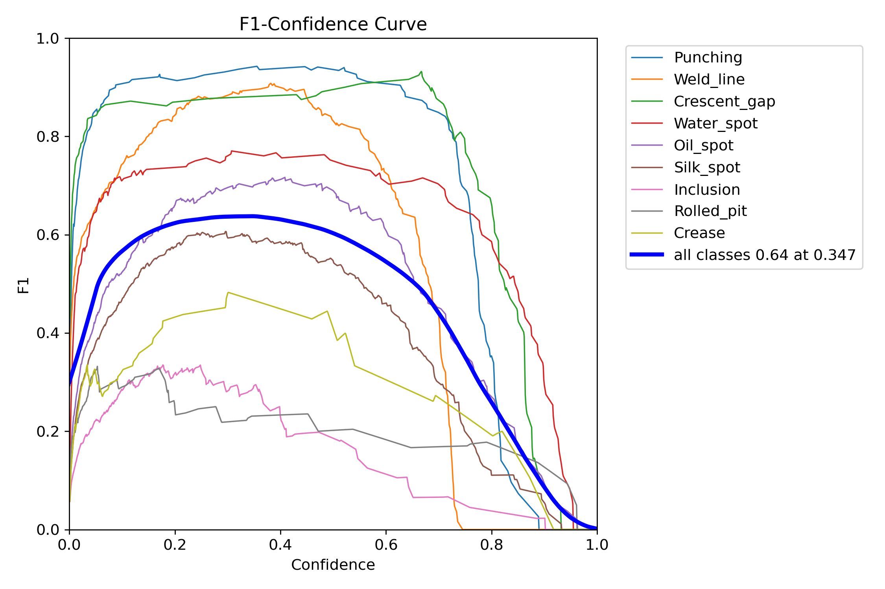
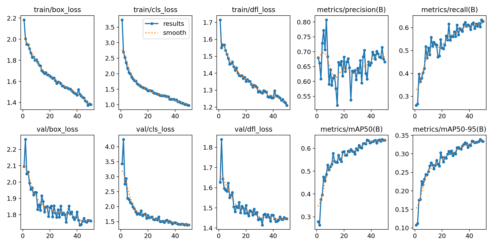
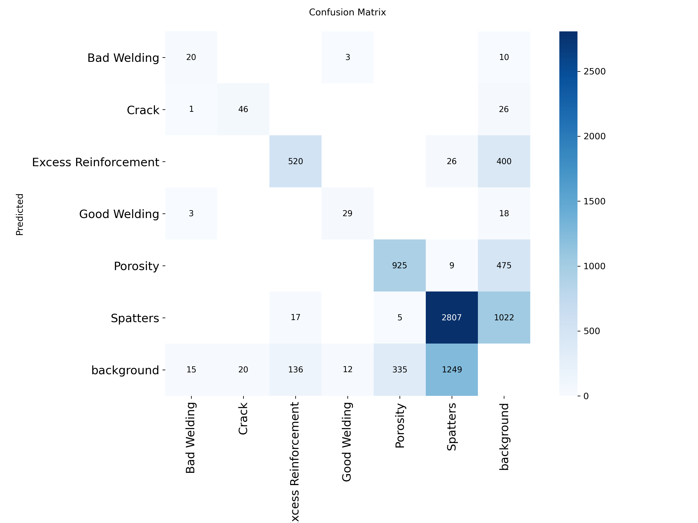
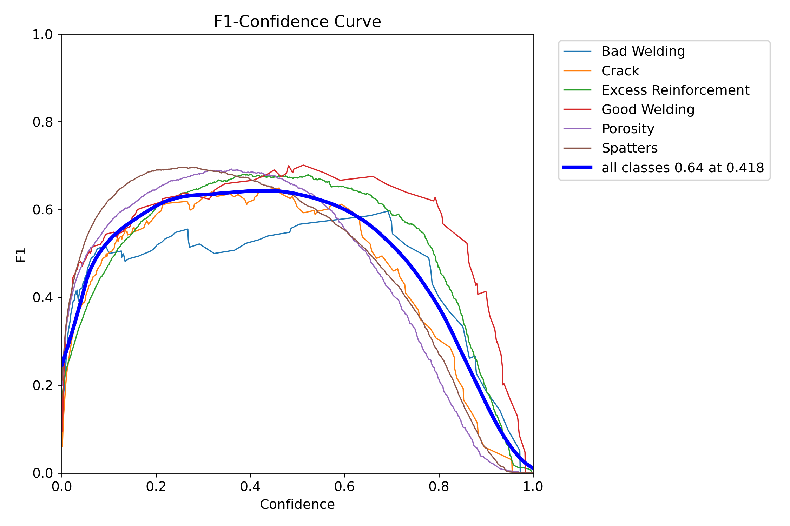
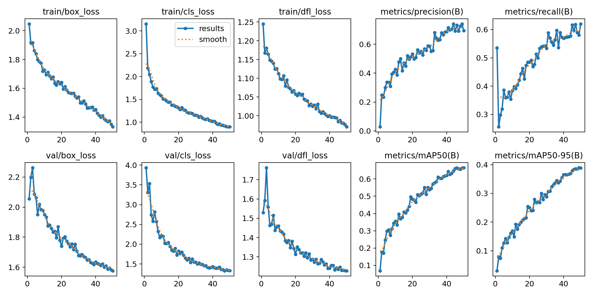

# Documentación del Entrenamiento de Modelos IA

Este documento detalla el proceso de entrenamiento, los datasets utilizados y el análisis de resultados para los dos modelos de Inteligencia Artificial integrados en el sistema.

## 1. Modelo de Defectos de Superficie (GC10-DET)

### Objetivo
Detectar contaminación y defectos en la superficie metálica *antes* del proceso de soldadura para asegurar una preparación adecuada del material base.

### Dataset
*   **Nombre**: GC10-DET (Metallic Surface Defect Dataset)
*   **Fuente**: Kaggle / Public Research
*   **Clases (10)**: Punching, Weld_line, Crescent_gap, Water_spot, Oil_spot, Silk_spot, Inclusion, Rolled_pit, Crease, Waist_folding.
*   **Preprocesamiento**: Conversión de anotaciones XML a formato YOLO.

### Configuración de Entrenamiento
*   **Modelo Base**: YOLOv8n (Nano)
*   **Épocas**: 50
*   **Tamaño de Imagen**: 640x640
*   **Optimizador**: Auto (SGD/AdamW)

### Análisis de Resultados

#### Métricas Globales
*   **Precisión (Precision)**: 0.715
*   **Exhaustividad (Recall)**: 0.604
*   **mAP@50**: 0.639

#### Visualizaciones
A continuación se presentan las gráficas generadas durante el entrenamiento:

**Matriz de Confusión:**

*Muestra qué clases se confunden entre sí. Una diagonal fuerte indica un buen rendimiento.*

**Curva F1:**

*Balance entre precisión y recall para diferentes umbrales de confianza.*

**Resultados de Entrenamiento:**

*Evolución de las pérdidas (loss) y métricas a lo largo de las épocas.*

---

## 2. Modelo de Defectos de Soldadura (Welding Defect)

### Objetivo
Inspeccionar el cordón de soldadura final para identificar defectos críticos que comprometan la integridad estructural.

### Dataset
*   **Nombre**: Welding Defect Detection
*   **Fuente**: Roboflow Universe
*   **Clases (6)**: Bad Welding, Crack, Excess Reinforcement, Good Welding, Porosity, Spatters.

### Configuración de Entrenamiento
*   **Modelo Base**: YOLOv8n (Nano)
*   **Épocas**: 50
*   **Tamaño de Imagen**: 640x640

### Análisis de Resultados

#### Métricas Globales
*   **Precisión (Precision)**: 0.694
*   **Exhaustividad (Recall)**: 0.620
*   **mAP@50**: 0.665

#### Interpretación de Clases
*   **Bad Welding**: El modelo agrupa defectos complejos o múltiples porosidades bajo esta etiqueta. En el sistema, esto se mapea a "Cordón Irregular".
*   **Porosity**: Detecta poros individuales claros.
*   **Crack**: Grietas longitudinales o transversales.

#### Visualizaciones

**Matriz de Confusión:**

**Curva F1:**

**Resultados de Entrenamiento:**

## Conclusiones y Recomendaciones
1.  **Superficie**: El modelo es efectivo para detectar manchas de aceite y agua, cruciales para la limpieza previa.
2.  **Soldadura**: El modelo tiene un buen desempeño general. Sin embargo, tiende a clasificar zonas con mucha porosidad como "Bad Welding" en lugar de contar cada poro.
    *   *Recomendación*: Para contar poros individuales en zonas muy afectadas, se sugiere re-entrenar con un dataset etiquetado a nivel de poro individual (instance segmentation o bounding boxes más granulares).
